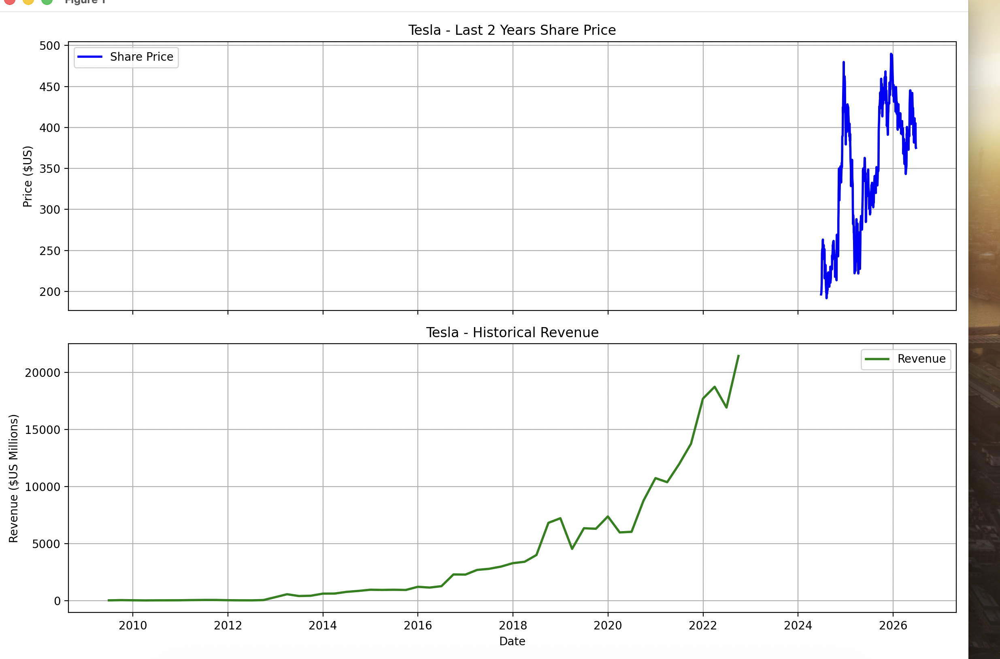
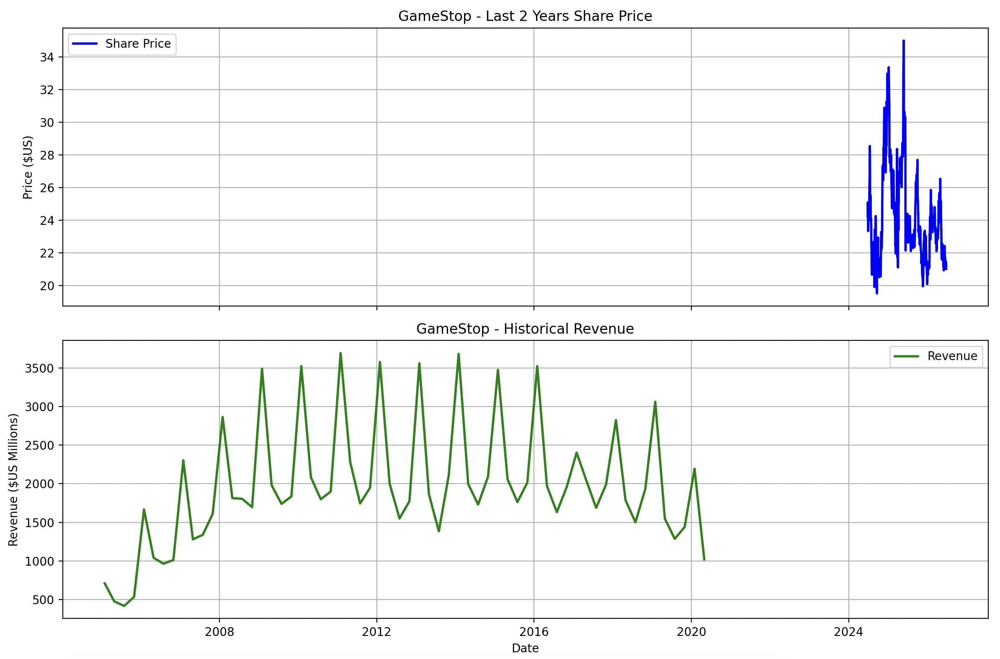

# 📈 Stock Market Data Extraction & Visualization

<p align="center">


</p>

---

# 📌 Overview

This project demonstrates how to extract, clean, analyze, and visualize financial market data using Python.

The project combines **API-based stock market data** with **web scraping techniques** to build a simple financial data analysis workflow.

The implementation demonstrates:

* 📈 Historical stock price extraction using **Yahoo Finance (`yfinance`)**
* 🌐 Revenue data extraction using **BeautifulSoup** and **Requests**
* 🧹 Data cleaning and preprocessing with **Pandas**
* 📊 Data visualization using **Matplotlib**

The repository uses **Tesla (TSLA)** and **GameStop (GME)** as demonstration companies. The same workflow can be adapted to other publicly traded companies supported by Yahoo Finance by changing the ticker symbol and providing an appropriate revenue data source.

> **Note:** The stock prices represent the latest two years available from Yahoo Finance, while the revenue information comes from an educational dataset used for web scraping practice. The visualizations are intended to demonstrate Python data extraction and visualization techniques rather than compare synchronized financial periods.

---

# 🚀 Features

* Download historical stock prices using Yahoo Finance
* Extract revenue data through web scraping
* Clean and preprocess financial datasets
* Visualize stock price trends
* Visualize historical revenue
* Modular and reusable code structure
* Easily adaptable for different stock tickers

---

# 🛠 Technologies Used

| Technology    | Purpose                  |
| ------------- | ------------------------ |
| Python        | Programming Language     |
| Pandas        | Data Analysis & Cleaning |
| yfinance      | Stock Market Data        |
| Requests      | HTTP Requests            |
| BeautifulSoup | Web Scraping             |
| Matplotlib    | Data Visualization       |

---

# 📂 Project Structure

```text
Stock-Data-Extraction-and-Visualization/
│
├── stock_analysis.py
├── README.md
├── requirements.txt
├── tesla_graph.png
└── gamestop_graph.png
```

---

# ⚙️ Installation

Clone the repository

```bash
git clone https://github.com/shiv26-coder/Stock-Data-Extraction-and-Visualization.git
```

Move into the project folder

```bash
cd Stock-Data-Extraction-and-Visualization
```

Install the required libraries

```bash
pip install -r requirements.txt
```

---

# ▶️ Running the Project

Run the script

```bash
python stock_analysis.py
```

The program will:

* Download historical stock prices
* Retrieve revenue data through web scraping
* Clean and preprocess the datasets
* Display stock price and revenue visualizations

---

# 📊 Example Companies

This project demonstrates the workflow using:

* Tesla (TSLA)
* GameStop (GME)

The same workflow can be extended to companies such as:

* Apple (AAPL)
* Microsoft (MSFT)
* Amazon (AMZN)
* NVIDIA (NVDA)
* Alphabet (GOOGL)
* Meta (META)

---

# 📷 Sample Output

| Tesla Analysis                  | GameStop Analysis                     |
| ------------------------------- | ------------------------------------- |
|  |  |

---

# 📚 Learning Outcomes

This project helped strengthen practical skills in:

* Financial data extraction
* API integration
* Web scraping
* Data preprocessing
* Exploratory Data Analysis (EDA)
* Financial data visualization
* Python programming

---

# 📦 Requirements

```text
pandas
yfinance
requests
beautifulsoup4
matplotlib
```

Install dependencies using

```bash
pip install -r requirements.txt
```

---

# 🔮 Future Improvements

* Support additional companies automatically
* Retrieve real-time financial statements through APIs
* Synchronize stock price and revenue over matching time periods
* Add technical indicators (SMA, EMA, RSI, MACD)
* Export charts automatically
* Build an interactive Streamlit dashboard

---

# 👨‍💻 Author

**Shivansh Misra**

B.Tech in Electronics & Communication Engineering (ECE)

SRM Institute of Science and Technology

---

## ⭐ Support

If you found this project useful, consider giving it a ⭐ on GitHub.
